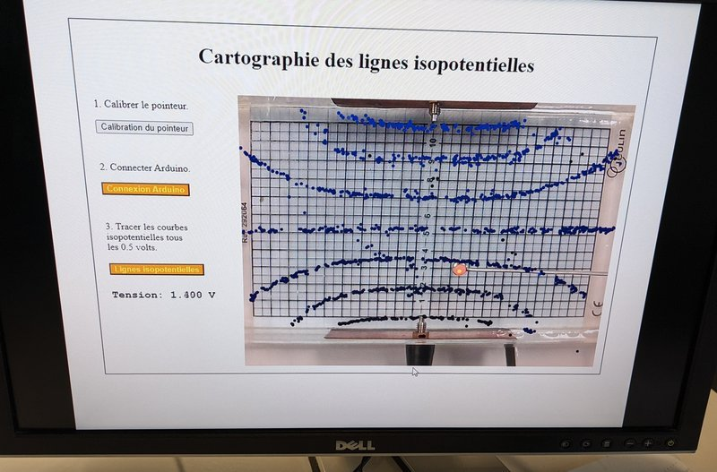
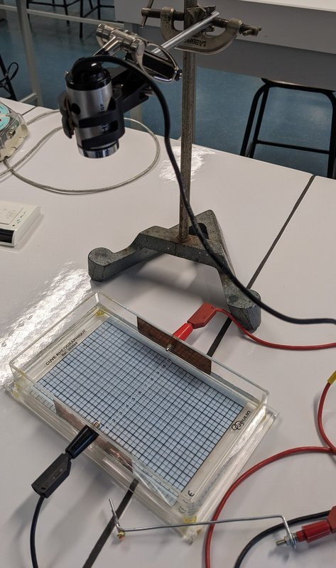
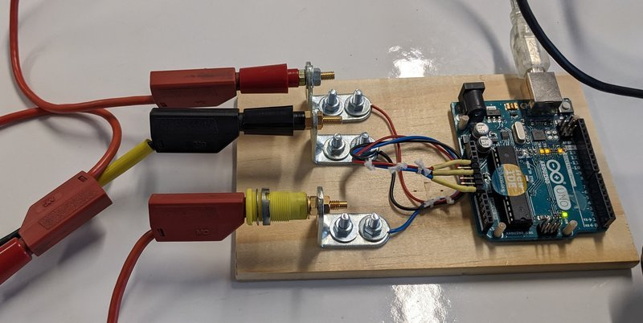
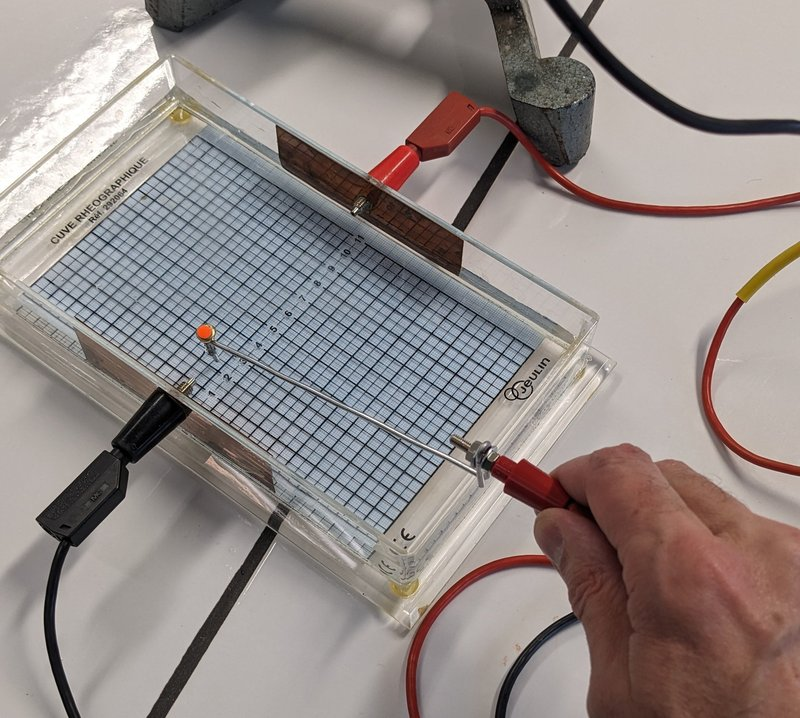
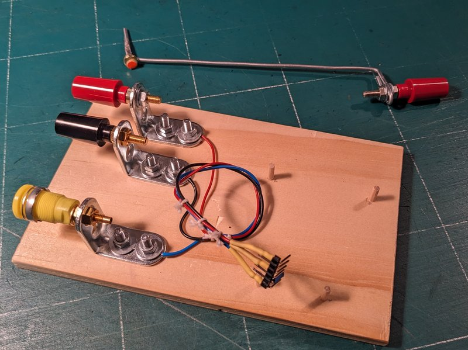
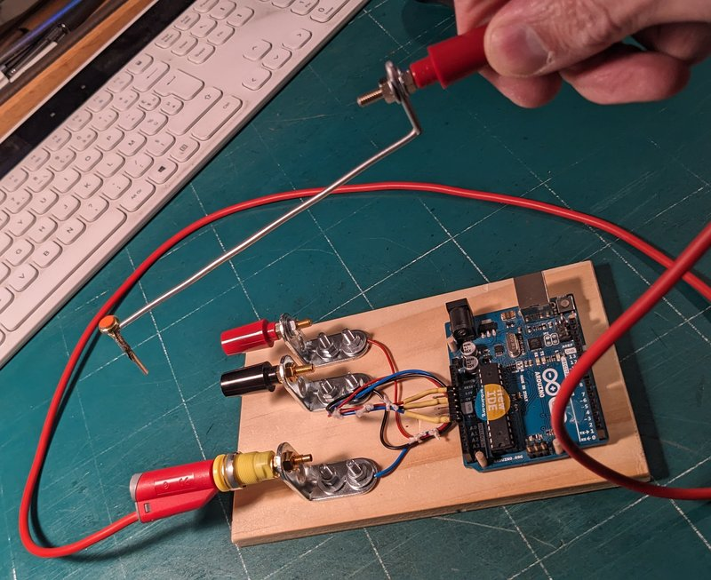
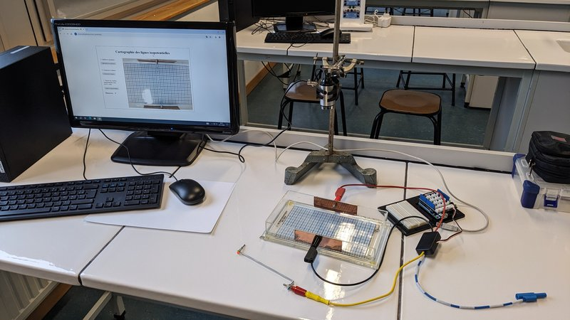
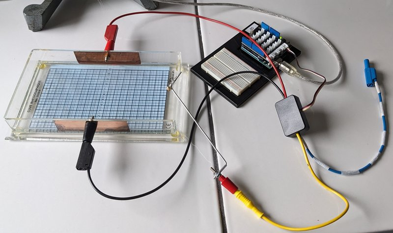

# Cartographie des lignes isopotentielles dans une cuve rhéostatique

## Résumé

_La cartographie des lignes isopotentielles dans une cuve rhéostatique est réalisée à l'aide d'une platine Arduino servant de voltmètre, et d'une webcam qui suit et enregistre la position de la sonde en temps réel pour tracer la série de lignes isopotentielles sur l'image de la cuve._ 

## Mode d'emploi

### Installation du script Arduino 

- Télécharger puis installer le script [voltmetre.ino](https://github.com/physicus68/carto_potentiels/blob/main/arduino/voltmetre/voltmetre.ino) sur une Arduino Uno R3.

### Installation du montage
- Une webcam est fixée à la verticale de la cuve rhéostatique de façon à filmer en plein écran la cuve. L'image sera tournée de 180° par l'application afin de paraître à l'endroit à l'écran.

  

- L'Arduino Uno R3 est placée sur son bornier, la cuve est alimentée sous 5 volts et la sonde est reliée à l'entrée A0 de l'Arduino via le bornier.

  
  
### Utilisation de l'application
- On se connecte avec Google Chrome ou Opera sur l'application https://physicus68.github.io/carto_potentiels.

> [!CAUTION]
> le navigateur Firefox ne fonctionne pas avec cette application (en novembre 2024, l'API webserial n'est pas encore implémentée dans Firefox).

- On doit d'abord calibrer la caméra pour suivre le repère orange fluo sur la sonde. On passe en mode calibration puis on clique sur le confetti orange visible sur l'écran, un spot jaune poursuit alors l'image du confetti. Si le suivi du mouvement est satisfaisant, on désactive le mode calibration en recliquant sur le bouton de calibration.

- L'étape suivante consiste à se connecter sur Arduino Uno qui mesure alors la tension dans la cuve à l'aide de la sonde.

- La dernière étape consiste à activer le mode cartographie des lignes isopotentielles. Elles s'affichent sur l'écran au fûr et à mesure que l'on explore la cuve rhéographique. Par défaut, le pas entre deux lignes est de 0.5 volts.

> [!CAUTION]
> la caméra a parfois du mal à suivre le confetti orange, si il existe des couleurs rouges ou orange visibles dans le champ de la caméra: il faut alors éviter de mettre ses mains visibles sous la caméra, et cacher sous des feuilles de papier les lames de cuivre, il faut aussi masquer la borne rouge et le câble rouge sous une feuille

  

  
  

## Fabrication du montage

### La sonde de mesure

- C'est un simple morceau de fil de fer d'environ 20cm de long, sur lequel a été soudée une attache parisienne, et sur la tête de laquelle on a collé un confetti orange fluo. Celui ci a été poinçonné avec une perforatrice dans une flêche orange fluo en carton (fourniture de vitrine de magasin) puis collé à la colle cyanolite sur le métal.
  
- Une borne a été fermement vissée sur une boucle à l'extrémité de la sonde.
  
> [!TIP]
> Pour souder à l'étain sur le fil de fer ou sur l'attache parisienne, il faut nettoyer la surface avec un décapant (flux de soudure, ou flux pour brasure disponnible au rayon plomberie d'un magazin de bricolage). 

> [!TIP]
> Pour avoir un fil de fer bien rectiligne, on coupe un morceau d'environ 2m de long, on bloque fermement une extrémité dans un étau, et l'autre dans le mandrin d'une perceuse visseuse-dévisseuse. On tend le fil de fer et on démarre doucement la perceuse  pour faire quelques tours. Rapidement, sous l'effet de la torsion, le fil de fer devient rigide et rectiligne. Il faut cependant faire très attention lors de cette opération au risque de rupture du fil qui pourrait frapper toute personne ou objet à proximité. Ayez des équipements de protections (vêtements couvrants et lunettes de sécurité).

### Le bornier pour Arduino Uno R3

Le bornier peut être un dispositif commercial (module Grove avec shield Grove pour Arduino Uno). On peut aussi se fabriquer un tel bornier en utilisant:

- une planchette 160mm x 100 mm environ.
- trois équerres d'assemblage de 30mm pour fixer les bornes.
- quatre morceaux de tige en bois de 3mm (pique à brochette) qui passent dans les trous de fixation de l'Arduino.
- fils de connexion et barette de connexion

> [!TIP]
> Une des pates est pliée ou munie d'un tube en plastique collé qui sert de détrompeur pour le branchement sur la platine Arduino. Les fils de connexions sont liés entre eux, et le faisceau ainsi obtenu est lié à une agraphe enfoncée dans la planche.
  

*Platine et sonde seules*

*Platine et sonde avec une Arduino montée*
 
### Arduino Uno R3 avec shield Grove et câble "fait maison"

Un exemple de montage, avec une platine Arduino équipée d'un shiel grove et d'un câble "fait maison". Le câble a été fabriqué par mon collègue J.D. Bourlier du lycée Louis Armand.

*Arduino avec shield Grove et câble personnalisé*

*Détail du câblage*

